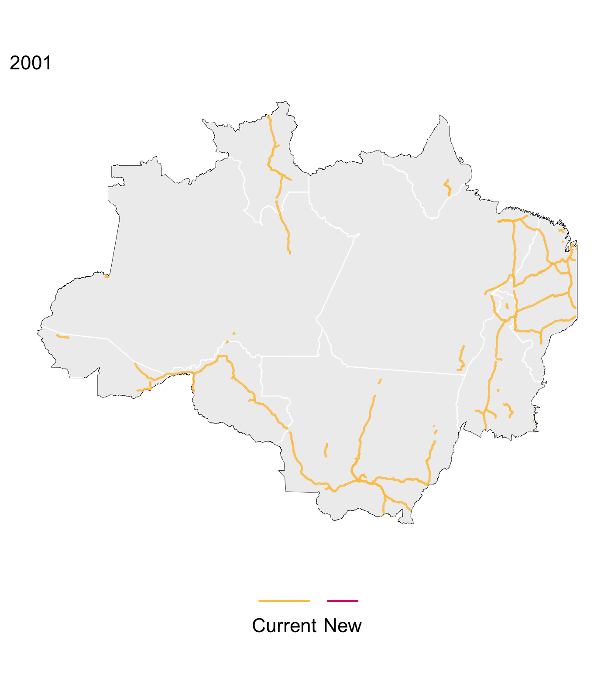

# AmazonPave: Annual highway paving data for the Brazilian Amazon (cleaned DNIT data)
> Yearly time series of newly paved highways in the Brazilian Amazon (2001-2024). Data sourced from [DNIT (Departamento Nacional de Infraestrutura de Transportes)](https://www.gov.br/transportes/pt-br/assuntos/dados-de-transportes/bit/bit-mapas) within the Brazilian Government. DNIT provides spatially explicit data from 2016-2024, AmazonPave extends the time series back to 2001. Code written by Alyson Singleton.
>
> If you use this dataset in your research or publications, please cite it as:
> Singleton, A. (2025). *AmazonPave: Annual highway paving data for the Brazilian Amazon (cleaned DNIT data)* Retrieved from [https://github.com/yourusername/amazonpave](https://github.com/alyson-singleton/AmazonPave).
> 
> Please feel free to email me with any questions at asinglet@stanford.edu.

__Data__:
* _text_: Text.

__Code__:
* _text_: Text.

__AmazonPave Visualization__: Pink shows new highways paved each year, yellow shows previously paved highways. 
